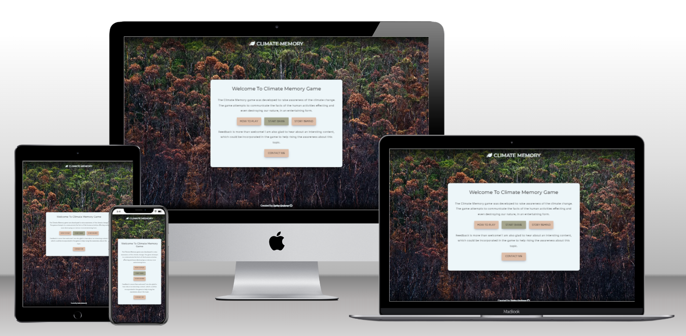
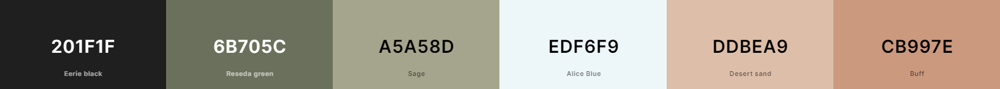
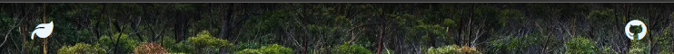

## Introduction
The Climate Memory website was created to raise the awareness of the climate change. The website attempts to present the facts of the human activities effecting the nature and the life of other people include our childern.

The website was developed as a memory game with additional features. In contrast to the classical memory game, the user tries to match an image with an corresponding image description. The content of the fliped card is everytime magnified in order to read the text or see the image properly.

The game is particularly for adults or children who can already read. The website could be used at schools for educative purposes as it provides evidence-based facts.

Click <a href="https://brodsa.github.io/climate-memory/" target="_blank"> here </a> to view the website and to play the game!

---

## Table of Contents
- [UX](#ux)
- [Features](#features)
- [Testing](#testing)
- [Deployment](#deployment)
- [References](#references)
- [Acknowledgements](#acknowledgemetns)

---

## UX
The purpose of the game is to communicate the facts about the climate change in an appealing and user-friedly way. The playing of the game is fun and informative at the same time. Moreover, the game can be played on various devices. 

### User Stories
- **First-Time User Goals**
    - US1: As a first-time visitor, I want to understand the purpose of the gama.
    - US2: As a first-time visitor, I want to the game is fun and interactive.
    - US3: As a first-time visitor, I want to found out interesting information about the climate change.
    - US4: As a first-time visitor, I want to understand the game rules.
    - US5: As a first-time visitor, I want to play the game on my mobile phone. 
    - US6: As A first-time visitor, I want to easily navigate through the webpage content.

- **Returning Visitor Goals**
    - US7: As a returning visitor, I want to found out more facts about the climate change.
    - US8: As a returning visitor, I want to suggest the developer to include additional facts or to provide him a feedback.

### Wireframes
The wireframes of the website were designed using [Balsamiq](https://balsamiq.com/wireframes/?gad=1&gclid=CjwKCAjwg-GjBhBnEiwAMUvNW8jCWKFMpgnd5PZlvwNQGIt7xJ05Fes_JeSsBSzyr7ToVpReN5VdOBoC80UQAvD_BwE). 
Two different layouts were mainly considered: 

- [Desktop Wireframe](https://github.com/brodsa/climate-memory/blob/main/assets/docs/ux/ux_wireframe_desktop.png)

- [Mobile Wireframe](https://github.com/brodsa/climate-memory/blob/main/assets/docs/ux/ux_wireframe_mobile.png)

### Fonts
Fonts were selected based on the [fontpair](https://www.fontpair.co/pairings/montserrat-hind). The fonts were included in the web page via the link tags, which were generated using the [Google Fonts](https://fonts.google.com/).

- The Montserrat was chosen for headings.
- The Hind was take for the body text, such as paragraphs.

### Colors
The color pallete was chosen using [coolors](https://coolors.co/palette/cb997e-ddbea9-ffe8d6-b7b7a4-a5a58d-6b705c) with a slight modification. The final colors includes the Eerie Black and Alice Blue, see [here](https://coolors.co/201f1f-6b705c-a5a58d-edf6f9-ddbea9-cb997e).

The chosen colors were evaluated in term of accessibitlity using the [toolnes](https://toolness.github.io/accessible-color-matrix/) tool. The resulting accessible color matrix revealed the following suggested combinations.

## Features
The website layout reflects the user stories as well as the components which are common practice in web design. In addition, the interactive elements were designed to provide the user with a feedback on the conductive activities.  

### Common Features
- **Header**
    - The Header is located at the top of the website.
    - The Header displays two icons:
        - The logo of the game navigates the user to homepage (US6).
        - The GitHub icon navigates the user the the GitHub profile of the developer (US5, US6).

    

- **Footer**
    - The Footer is located at the bottom of the website.
    - The Footer displays the developer name the link to the GitHub profil.

    

### Homepage Featers

## Testing

### HTML 
- [Homepage](https://validator.w3.org/nu/?doc=https%3A%2F%2Fbrodsa.github.io%2Fclimate-memory%2Findex.html)
- [Game Page](https://validator.w3.org/nu/?doc=https%3A%2F%2Fbrodsa.github.io%2Fclimate-memory%2Fgame.html)
- [404 Page](https://validator.w3.org/nu/?doc=https%3A%2F%2Fbrodsa.github.io%2Fclimate-memory%2F404.html)
- [Thank You Page](https://validator.w3.org/nu/?doc=https%3A%2F%2Fbrodsa.github.io%2Fclimate-memory%2Fthank_you.html)

### CSS
- [Homepage](https://jigsaw.w3.org/css-validator/validator?uri=https%3A%2F%2Fbrodsa.github.io%2Fclimate-memory%2Findex.html&profile=css3svg&usermedium=all&warning=1&vextwarning=&lang=en)
- [Game Page](https://jigsaw.w3.org/css-validator/validator?uri=https%3A%2F%2Fbrodsa.github.io%2Fclimate-memory%2Fgame.html&profile=css3svg&usermedium=all&warning=1&vextwarning=&lang=en)
- [404 Page](https://jigsaw.w3.org/css-validator/validator?uri=https%3A%2F%2Fbrodsa.github.io%2Fclimate-memory%2F404.html&profile=css3svg&usermedium=all&warning=1&vextwarning=&lang=en)
- [Thank You Page](https://jigsaw.w3.org/css-validator/validator?uri=https%3A%2F%2Fbrodsa.github.io%2Fclimate-memory%2Fthank_you.html&profile=css3svg&usermedium=all&warning=1&vextwarning=&lang=en)

### Accessibility
- [Homepage](https://wave.webaim.org/report#/https://brodsa.github.io/climate-memory/)
- [Game Page](https://wave.webaim.org/report#/https://brodsa.github.io/climate-memory/game.html)
- [404 Page](https://wave.webaim.org/report#/https://brodsa.github.io/climate-memory/404.html)
- [Thank You Page](https://wave.webaim.org/report#/https://brodsa.github.io/climate-memory/thank_you.html)

### Bugs & Issues
- text in modal card is sometimes cut off; solution: remove all classes specific to the type of card (i.e. card__modal--txt) after closing the card modal and to read the text properly, make the modal larger
- the blue color of buttons on iphone; specify the color and set webkit
-  Js Validator: missing semicolons and advice to used the dot notation when working with the objects

---

## Deployment
The site was deployed to GitHub Pages. The steps to deploy the webpage were following: 
- In the GitHub repository, the Settings Section was selected.
- The Page Category on the left hand side was selected.
- Under the Branch Section, the source branch from the drop-down menu (e.g. master branch) was chosen.
- The Save Button was cliked on.
- The page url was generated, which indicates the successful deployment. 
  
The website can be viewed <a href="https://brodsa.github.io/climate-memory/" target="_blank"> here </a> 

During the development, the commit type was included in commit messages, following [the blog post](https://www.freecodecamp.org/news/how-to-write-better-git-commit-messages/).

## Clone the Repository
The repository can also be cloned locally, the steps are following:

1. On Git
    - Go to the repository, i.e. https://github.com/brodsa/mgv-vorau
    - You see the content of the repository, i.e. all the files are listed. On the right side at the top of the list, find the Code drop down button and click on it.
    - Copy the repository HTTPS link to the clipboard.
2. In the terminal (Note: git must be preinstalled) 
    - Open the terminal and navigate, where you want to clone the repository.
    - Type `git clone` and insert the content from the clipboard, leading to the command `git clone https://github.com/brodsa/climate-memory.git`. 
    - Once the project is cloned, you can start using the repository locally.

---
## Languages
- HTML
- CSS
- JavaScript
- Markdown

---
## References

### Credits & Insipirations

- JavaScript Tutorial & Documentations
    - [Web Dev Simplified](https://www.youtube.com/@WebDevSimplified)
    - [JavaScript DOM Manipulation](https://www.youtube.com/watch?v=5fb2aPlgoys)
    - [Code with Mosh](https://codewithmosh.com/p/ultimate-javascript-series)
    - Memory Game
        - [freeCodeCamp](https://www.youtube.com/watch?v=ZniVgo8U7ek)
        - [Ferenc Almasi](https://webtips.dev/memory-game-in-javascript?utm_content=cmp-true)
    - [Stack Overflow](https://stackoverflow.com/)
    - [W3schools](https://www.w3schools.com/js/default.asp)
    - [MDN Web Docs](https://developer.mozilla.org/en-US/)
- Data for the Memory Game
    - [Our world in data](https://ourworldindata.org/per-capita-co2)
    - [The Climate Book by Greta Thunberg](https://www.amazon.de/Climate-Book-Greta-Thunberg/dp/0241547474/ref=sr_1_1?adgrpid=73939651914&hvadid=352944569214&hvdev=c&hvlocphy=1030962&hvnetw=g&hvqmt=e&hvrand=2852190861556407914&hvtargid=kwd-1433668333381&hydadcr=24125_1739945&keywords=the+climate+book&qid=1685468438&sr=8-1)
    - [IEEP](https://ieep.eu/publications/carbon-inequality-in-2030-per-capita-consumption-emissions-and-the-1-5c-goal/#:~:text=To%20stay%20within%20this%20guardrail,every%20person%20on%20Earth%20today.)
    - [Fontawesome](https://fontawesome.com/)
    - [Temperature stripes](https://showyourstripes.info/s/globe) by [Ed Hawkins](http://www.met.reading.ac.uk/~ed/home/index.php)

### Technologies & Tools
- [Google Fonts]() was used to import the fonts into the style.css file.
- [Color Pallete](https://coolors.co/palette/006d77-83c5be-edf6f9-ffddd2-e29578) was used to select accessible colors.
- [Image Compressor](https://tinypng.com/) was used to compress the images.
- [Image Converter](https://ezgif.com/) was used to convert all images in the webp format.
- [Favicon](https://realfavicongenerator.net/) was used to generate the code and files for the webpage favicon.
- [GitHub](https://github.com/) was used to store the code and host the website.
- [Gitpod](https://www.gitpod.io/) is an IDE and was used to develop the website.
- [Formsubmit](https://formsubmit.co/) was used for the form submission.
- [Mockup Generator](https://techsini.com/multi-mockup/?url=http://www.example.com) was used to generate the mockup for README.
- [Balsamiq](https://balsamiq.com/wireframes/?gad=1&gclid=CjwKCAjwg-GjBhBnEiwAMUvNW8jCWKFMpgnd5PZlvwNQGIt7xJ05Fes_JeSsBSzyr7ToVpReN5VdOBoC80UQAvD_BwE) was used to create wireframes.

## Acknowledgements