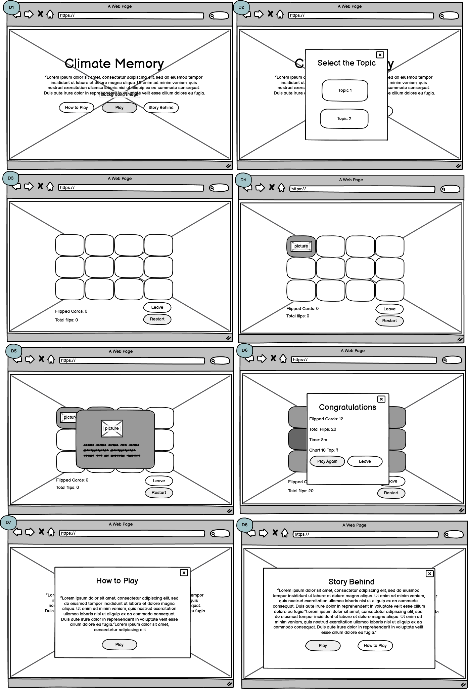
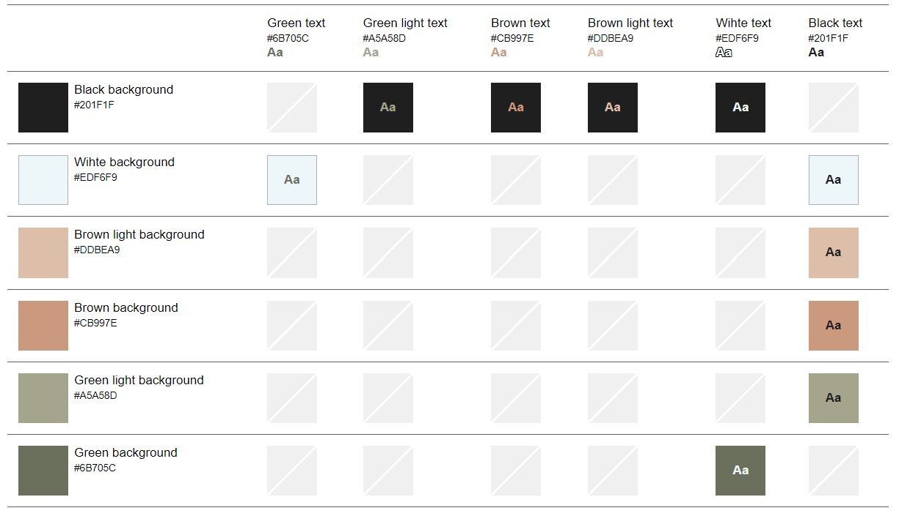

## Table of Contents
- [Introduction](#introduction)
- [UX](#ux)
- [Features](#features)
- [Testing](#testing)
- [Deployment](#deployment)
- [References](#references)
- [Acknowledgements](#acknowledgemetns)

---

## Introduction

## UX

### User Stories

### Wireframes

## Fonts
Fonts were selected based on the [fontpair](https://www.fontpair.co/pairings/montserrat-hind). The fonts were included in the web page via the link tags, which were generated using the [Google Fonts](https://fonts.google.com/).

# Colors
The color pallete was chosen using [coolors](https://coolors.co/palette/cb997e-ddbea9-ffe8d6-b7b7a4-a5a58d-6b705c) with a slight modification. The final colors includes the Eerie Black and Alice Blue, see [here](https://coolors.co/201f1f-6b705c-a5a58d-edf6f9-ddbea9-cb997e).

The chosen colors were evaluated in term of accessibitlity using the [toolnes](https://toolness.github.io/accessible-color-matrix/) tool. The resulting accessible color matrix revealed the following suggested combinations.

## Features

## Testing

## Deployment

## References

## Acknowledgements